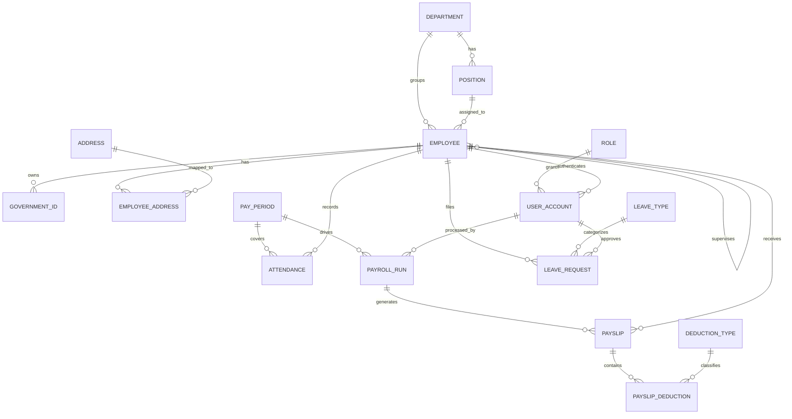

# MotorPH ERD (Entity Relationship Diagram)

This document translates the provided ERD image into a relational data model reference for implementation and future database migration.

## Core Entities

### 1) `employee`
- **PK**: `employee_id`
- **Unique**: `employee_number`
- Attributes: `first_name`, `last_name`, `dob`, `phone_number`, `employment_status`, `hire_date`
- **FK**:
  - `department_id` → `department.department_id`
  - `position_id` → `position.position_id`
  - `supervisor_employee_id` → `employee.employee_id` (self-reference)

### 2) `department`
- **PK**: `department_id`
- Attributes: `department_name`

### 3) `position`
- **PK**: `position_id`
- Attributes: `position_title`
- **FK**: `department_id` → `department.department_id`

### 4) `government_id`
- **PK**: `gov_id`
- **FK**: `employee_id` → `employee.employee_id`
- Attributes: `id_type` (SSS/PhilHealth/TIN/Pag-IBIG), `id_number`

### 5) `address`
- **PK**: `address_id`
- Attributes: `street`, `barangay`, `city`, `province`, `zip_code`

### 6) `employee_address`
- **Composite PK/FK**: (`employee_id`, `address_id`)
- **FK**:
  - `employee_id` → `employee.employee_id`
  - `address_id` → `address.address_id`
- Attributes: `address_type`, `start_date`, `end_date`

### 7) `role`
- **PK**: `role_id`
- Attributes: `role_name` (Admin/HR/Employee/Manager)

### 8) `user_account`
- **PK**: `user_id`
- **FK**:
  - `employee_id` → `employee.employee_id`
  - `role_id` → `role.role_id`
- Attributes: `username` (unique), `password_hash`, `is_active`

### 9) `pay_period`
- **PK**: `pay_period_id`
- Attributes: `period_start`, `period_end`, `pay_date`

### 10) `attendance`
- **PK**: `attendance_id`
- **FK**:
  - `employee_id` → `employee.employee_id`
  - `pay_period_id` → `pay_period.pay_period_id`
- Attributes: `work_date`, `time_in`, `time_out`, `total_hours`, `overtime_hours`, `late_minutes`, `attendance_status`

### 11) `payroll_run`
- **PK**: `payroll_run_id`
- **FK**:
  - `pay_period_id` → `pay_period.pay_period_id`
  - `processed_by_user_id` → `user_account.user_id`
- Attributes: `payroll_status`, `generated_at`

### 12) `payslip`
- **PK**: `payslip_id`
- **FK**:
  - `payroll_run_id` → `payroll_run.payroll_run_id`
  - `employee_id` → `employee.employee_id`
- Attributes: `gross_pay`, `total_allowances`, `total_deductions`, `withholding_tax`, `net_pay`

### 13) `deduction_type`
- **PK**: `deduction_type_id`
- Attributes: `deduction_name`, `deduction_category`

### 14) `payslip_deduction`
- **PK**: `payslip_deduction_id`
- **FK**:
  - `payslip_id` → `payslip.payslip_id`
  - `deduction_type_id` → `deduction_type.deduction_type_id`
- Attributes: `amount`

### 15) `leave_type`
- **PK**: `leave_type_id`
- Attributes: `leave_type_name`, `is_paid`

### 16) `leave_request`
- **PK**: `leave_id`
- **FK**:
  - `employee_id` → `employee.employee_id`
  - `leave_type_id` → `leave_type.leave_type_id`
  - `approved_by_user_id` → `user_account.user_id`
- Attributes: `start_date`, `end_date`, `reason`, `leave_status`, `date_requested`, `date_approved`

---

## Mermaid ERD (logical model)

---

## Mapping Notes for Current CSV-Based App

- The current application is CSV-based (not yet RDBMS-backed), so this ERD should be treated as the **target normalized schema**.
- Existing CSV columns in `motorph_employee_data.csv` map mostly to:
  - `employee`
  - `government_id`
  - `position` + `department`
- `authorized_accounts.csv` maps to `user_account` + `role`.
- `motorph_attendance_records.csv` maps to `attendance`.
- `leave_requests.csv` maps to `leave_request`.

